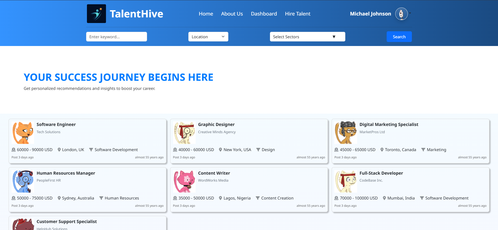
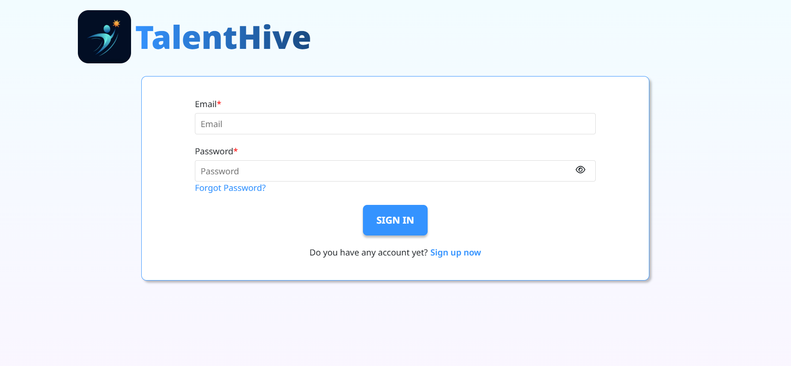
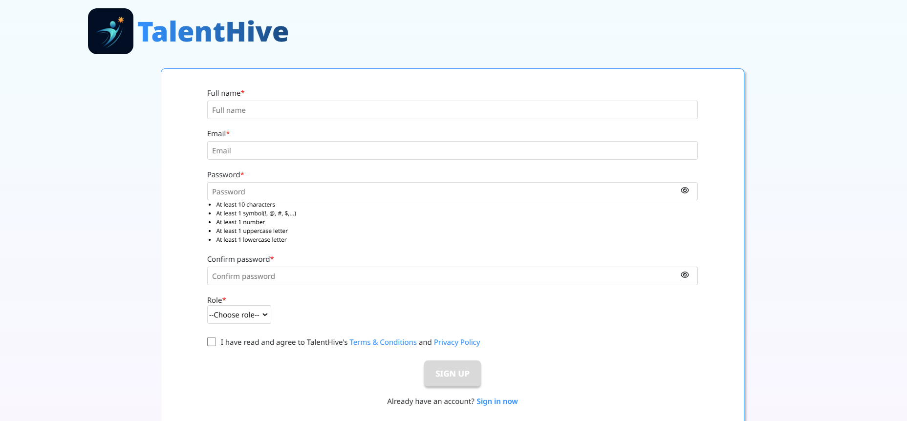
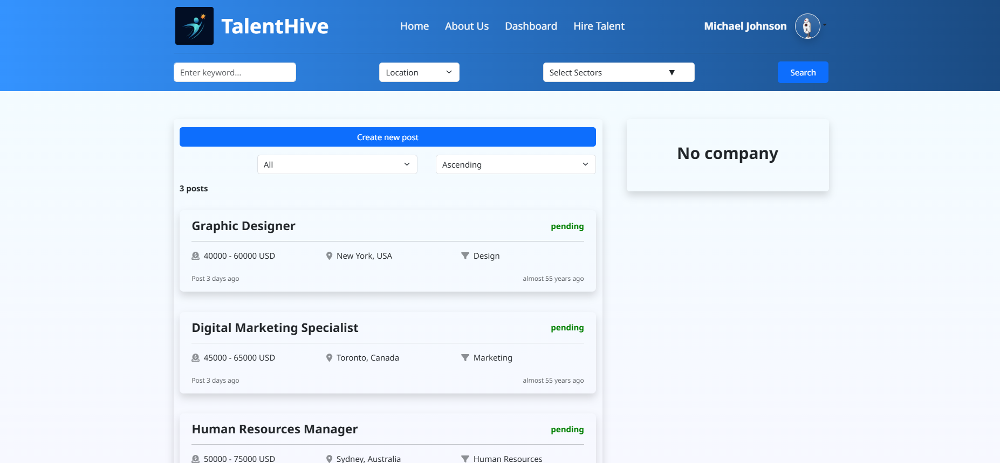
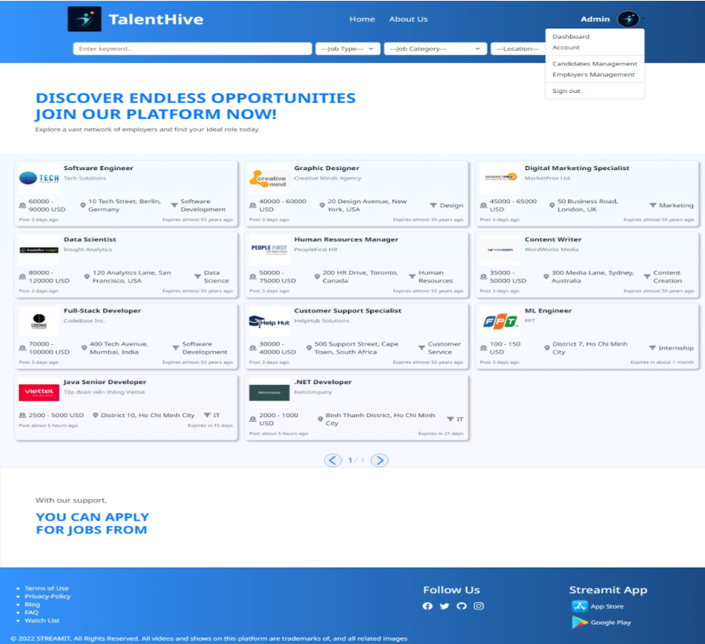
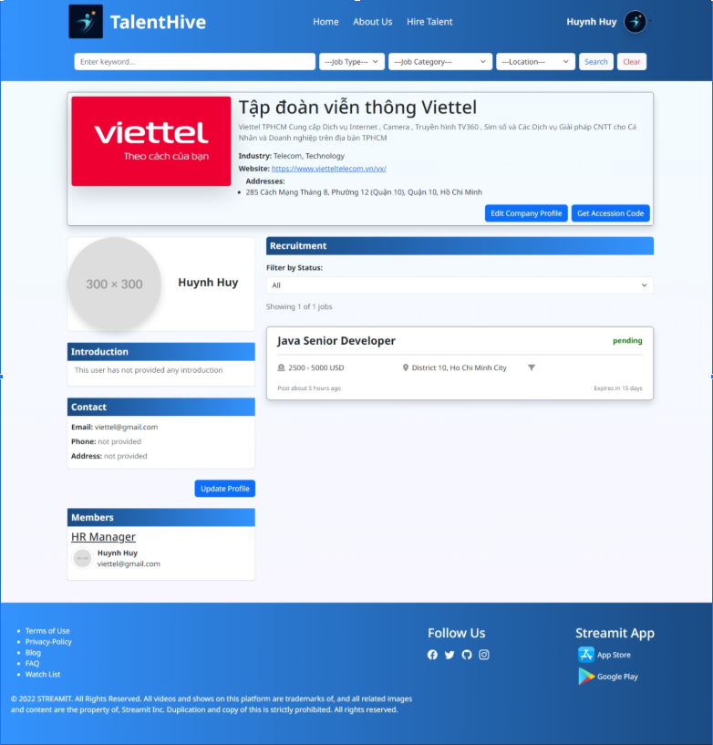
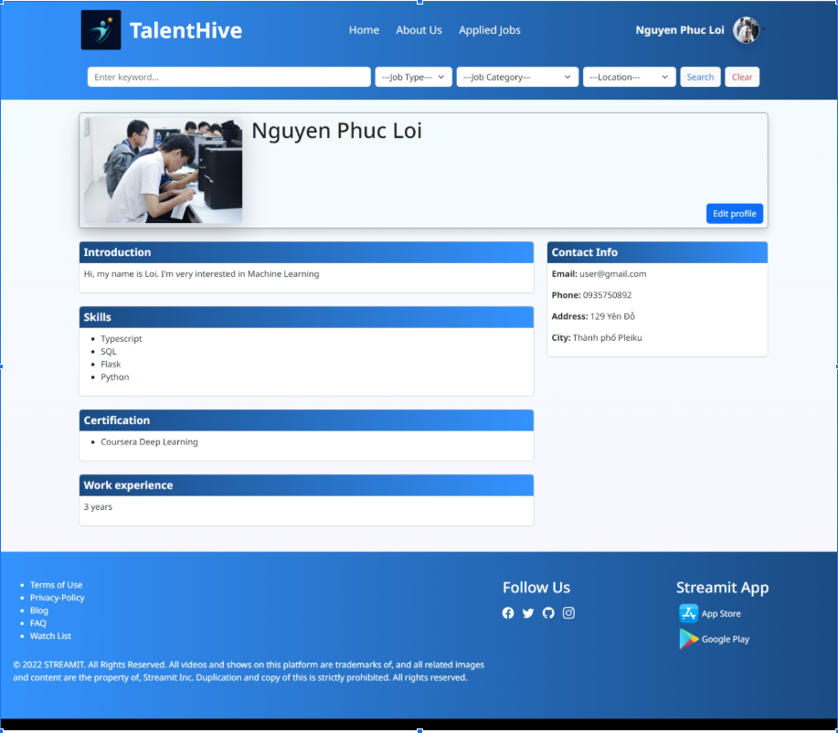

# Talent Hive

Talent Hive is a collaborative recruitment platform that streamlines the hiring process for employers and job seekers. Built with modern technologies and following Agile methodologies, this project is structured into six sprints (PAs 1-6), each documented in the `pa/` folder within the repository.

## 🕐 Table of Contents

- [Features](#-features)
- [Technologies Used](#️-technologies-used)
- [Screenshots](#-screenshots)
- [Folder Structure](#-folder-structure)
- [Getting Started](#-getting-started)
  - [Backend Setup](#backend-setup)
  - [Frontend Setup](#frontend-setup)
- [Contributing](#--contributing)

---

## 🚀 Features

### User Roles:
1. **Employer Dashboard**: Post jobs, review applicants, and manage recruitment.
2. **Candidate Dashboard**: Search for jobs, apply for positions, and track application status.
3. **Admin Dashboard**: Manage users, jobs, and overall system settings.

### Key Functionalities:
- **Home Page**: Introduction to Talent Hive’s features.
- **Login/Signup**: Secure authentication for employers, candidates, and admins.
- **Hire Talent**: A specialized page for employers to find top candidates.

## 🛠️ Technologies Used

### Backend
- **Framework**: Express.js (TypeScript)
- **Database**: MongoDB Atlas (via Mongoose)
- **API Design**: RESTful APIs with JSend response format

### Frontend
- **Framework**: React.js (Vanilla JavaScript)

### Agile Workflow
- **Collaboration Tool**: Jira for project management, Git for version control, and GitHub as the hosting platform
- **Sprints**: 6 sprints documented as PA1 to PA6 in the `pa/` folder

---

## 📸 Screenshots

1. **Home Page**
   

2. **Login Page**
   

3. **Signup Page**
   

4. **Hire Talent Page**
   

5. **Admin Dashboard**
   

6. **Employer Dashboard**
   

7. **Candidate Dashboard**
   

---

## 📁 Folder Structure

```
repo/
├── backend/
│   ├── src/
│   │   ├── controllers/
│   │   ├── models/
│   │   ├── routes/
│   │   └── utils/
│   ├── example.env
│   ├── package.json
│   └── tsconfig.json
├── frontend/
│   ├── public/
│   ├── src/
│   │   ├── components/
│   │   ├── pages/
│   │   └── services/
│   ├── example.env
│   ├── package.json
│   └── README.md
├── pa/
│   ├── PA1.md
│   ├── PA2.md
│   └── ...
└── README.md
```

---

## 💻 Getting Started

### Prerequisites
- Node.js (v18+)
- MongoDB Atlas account
- npm (v8+)

### Backend Setup
1. Clone the repository:
   ```bash
   git clone https://github.com/your-username/talent-hive.git
   cd talent-hive/backend
   ```

2. Install dependencies:
   ```bash
   npm install
   ```

3. Configure environment variables:
   - Copy `example.env` to `.env`:
     ```bash
     cp example.env .env
     ```
   - Fill in the required fields, including `MONGO_URI` for connecting to MongoDB Atlas:
     - To get your MongoDB Atlas URI:
       1. Log in to your MongoDB Atlas account.
       2. Create a cluster (if not already created).
       3. Navigate to **Database Access** and add a new user with access rights.
       4. Go to **Connect**, select "Connect your application," and copy the connection string.
       5. Replace `<password>` with your user password and `<dbname>` with your database name.

4. Start the server:
   ```bash
   npm start
   ```

### Frontend Setup
1. Navigate to the frontend folder:
   ```bash
   cd ../frontend
   ```

2. Install dependencies:
   ```bash
   npm install
   ```

3. Configure environment variables:
   - Copy `example.env` to `.env`:
     ```bash
     cp example.env .env
     ```
   - Fill in the required fields.

4. Start the development server:
   ```bash
   npm start
   ```

### Accessing the Application
- Frontend: [http://localhost:3000](http://localhost:3000)
- Backend: [http://localhost:5000/api](http://localhost:5000/api)

---

## 🤝  Contributing
1. Fork the repository.
2. Create a feature branch:
   ```bash
   git checkout -b feature-name
   ```
3. Commit your changes:
   ```bash
   git commit -m "Add feature-name"
   ```
4. Push to your branch:
   ```bash
   git push origin feature-name
   ```
5. Create a pull request.

